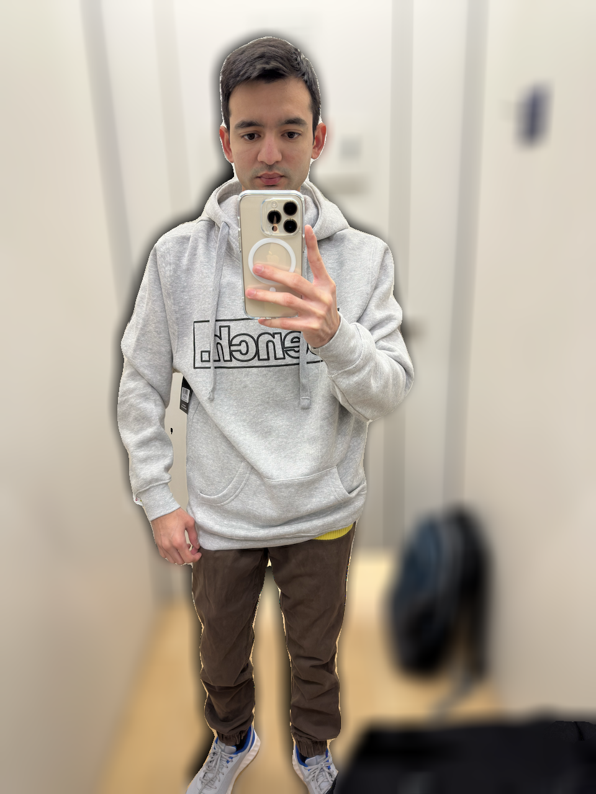

# bokehME
People may have diverse motives to blur the background of an image. Somebody might want to look photogenic on Instagram, somebody might want to look professional on LinkedIn, and somebody might want to hide all personally identifiable information (PII) in the image. Irrespective of your use case, this codebase will help you blur the background of your image while leaving the subject intact even if it is not a portrait. 

## Quick Start (Local module)

All you need to do is supply the path of the source image to be blurred as a command line argument.

```
python bokehME.py <image_src.extension>
```

## Algorithm
- First, we isolate the subject of the supplied image using ML techniques and save it as a new image. We use PyTorch and DeepLab’s pre-trained models to segment the image. 
- Next, the subject should be removed from the original image. This is step is exactly opposite of the first step. Again, this is powered by PyTorch and DeepLab’s pre-trained models.
- Apply Gaussian blur filter to the background (original image without subject)
- Superimpose/overlay the subject on the blurred background
- Save the combination as a new image

## Sample output



## Key Challenges 
- Powerful image editors such as those offered by Apple allow users to adjust the background blur of a portrait photo. However, sometimes we may find ourselves in a situation where we didn’t take a portrait photo but later wished to have the background blurred.
- One may resort to popular image processing libraries like OpenCV. However, standard filters such as Gaussian blur cannot distinguish between the subject and the background. They apply blur to the entire photo. 
- Even if we one were to find algorithms that achieved the goal of blurring the background, the quality of the resultant image could be questionable. It is a common observation that blurring an image messes up the edges of the subjects in the photo. Sometimes, the result looks so fake and artificial that it is better to leave the photo untouched! Edge refinement is a serious problem to be tackled.

## Reference
For further reference please read my blog:
A noob’s guide to adding stunning bokeh effects to the backgrounds of ‘non-portrait photos’
<br>
[bokehME](https://appstasy-assets.s3.ca-central-1.amazonaws.com/nandinee/TESTynamo.pdf)

```
https://appstasy-assets.s3.ca-central-1.amazonaws.com/nandinee/TESTynamo.pdf
```
